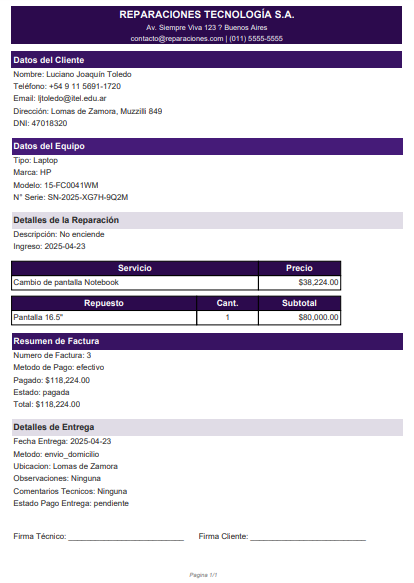

# 🛠️ ReparaPro – Sistema Web Integral de Reparaciones

**ReparaPro** es una solución web robusta y eficiente para la gestión de servicios técnicos. Diseñada especialmente para talleres que reparan computadoras, celulares, consolas y otros dispositivos electrónicos. Permite administrar clientes, equipos, reparaciones, repuestos, stock y facturación desde una única plataforma accesible vía navegador.

<p align="center">
  
  
  
  
</p>

---

## 🚀 Características principales

- 👥 Gestión completa de clientes
- 💻 Registro detallado de equipos (PC, laptops, consolas, teléfonos)
- 🔧 Seguimiento de órdenes de reparación con cambios de estado
- 📦 Administración de repuestos y stock
- 🧾 Generación automática de facturas (servicios + repuestos)
- 📊 Reportes visuales por técnico, estado o tipo de reparación
- 🔐 Acceso con sistema de login seguro
- 📱 Interfaz responsiva compatible con dispositivos móviles

---

## 🖼️ Capturas de pantalla


| Panel Principal 📊 | Registro de Equipos 💻 | Generación de Facturas 💵 |
|--------------------|------------------------|----------------------------|
|  |  |  |

---

## 🛠️ Tecnologías utilizadas

| Tecnología      | Función                              |
|-----------------|--------------------------------------|
| **PHP**         | Lógica del backend y conexión a BD   |
| **MySQLi**      | Gestión de base de datos relacional  |
| **HTML5 / CSS3**| Estructura y estilos del frontend    |
| **Bootstrap 5** | Componentes UI y diseño responsivo   |
| **JavaScript**  | Dinamismo, modales y validaciones    |
| **FontAwesome** | Iconografía atractiva                |

---

## ⚙️ Instalación local

```bash
# 1. Clonar el repositorio
git clone https://github.com/tu-usuario/reparapro.git
cd reparapro

# 2. Importar la base de datos
#    - Usá phpMyAdmin o línea de comandos para importar database.sql

# 3. Configurar conexión
#    - Editá el archivo: /config/conexion.php

# 4. Ejecutar en navegador con XAMPP, Laragon u otro
http://localhost/reparapro
```
---

## 🧩 Módulos disponibles

| Módulo        | Descripción                                                       |
|---------------|-------------------------------------------------------------------|
| **Clientes**  | Alta, edición, consulta por nombre o DNI                          |
| **Equipos**   | Registro con campos dinámicos por tipo (PC, móvil, consola, etc.) |
| **Reparaciones** | Gestión con flujo de estado: Pendiente → En reparación → Finalizado |
| **Servicios** | Carga desde modal, con tipo y precio                             |
| **Repuestos** | Selección desde el stock y asignación por reparación              |
| **Facturas**  | Generación automática, sumando servicios y repuestos              |
| **Reportes**  | Estadísticas por técnico, estado y tipo de servicio               |

---

## 🧠 Próximas mejoras

- 📱 Interfaz móvil aún más optimizada  
- ⏱️ Reducción de latencia y carga asincrónica  
- 👨‍🔧 Validación con técnicos reales del rubro  
- 🧑‍💼 Soporte para múltiples usuarios y roles de acceso  

---

## 👨‍💻 Autor

**Luciano Joaquín Toledo**  
💻 Programador Backend en PHP & MySQLi  
🎨 Frontend en HTML, CSS, JS y Bootstrap  
📍 Argentina, 2024

---

## 📄 Licencia

Este proyecto se encuentra bajo la **[Licencia MIT](LICENSE)**.  
Uso libre para fines personales, comerciales o educativos, con atribución requerida.

---

<p align="center">
  <i>Creado con pasión por la tecnología, la eficiencia y el código limpio ⚙️💡</i>
</p>

